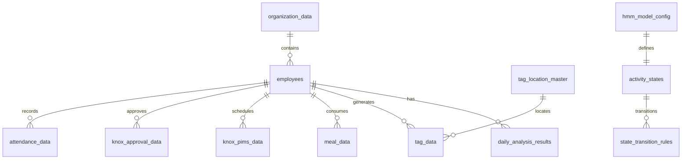

# Database Schema Documentation

## 📊 Sambio Human Analytics Database Schema

> Last Updated: 2025-08-11 14:35:00
> Database: `data/sambio_human.db`
> Total Tables: 54
> Total Records: 4,671,321

## 📈 Overview

| Category | Tables | Total Records |
|----------|--------|---------------|
| Knox 시스템 데이터 | 3 | 502,093 |
| Equipment 시스템 데이터 | 7 | 980,448 |
| 인사/근태 데이터 | 10 | 590,238 |
| 태깅 데이터 | 8 | 1,803,506 |
| 식사 데이터 | 1 | 710,583 |
| HMM 모델 관련 | 3 | 47 |
| 분석 결과 | 5 | 84,285 |
| 작업 관리 | 5 | 0 |
| 배치 작업 | 4 | 121 |
| 기타 | 5 | 0 |
| **Total** | **54** | **4,671,321** |

## 🔗 Table Relationships



## Knox 시스템 데이터

### 📋 `knox_pims_data` - Knox PIMS (일정/회의)

- **Records**: 66,645
- **Description**: Knox PIMS 시스템의 일정 및 회의 데이터
- **Period**: 2025-06-01 ~ 2025-06-30

| Column | Type | Description |
|--------|------|-------------|
| id | INTEGER | Primary Key |
| employee_id | INTEGER | 직원 ID |
| meeting_id | VARCHAR(100) | 일정 ID |
| meeting_type | VARCHAR(50) | 키워드 분류 (회의/보고/면담, 업무, 교육/행사) |
| start_time | DATETIME | 시작 시간 (GMT+9) |
| end_time | DATETIME | 종료 시간 (GMT+9) |
| created_at | DATETIME | 생성 시각 |

### 📋 `knox_approval_data` - Knox 결재

- **Records**: 339,818
- **Description**: Knox 결재 시스템 데이터
- **Period**: 2025-05-12 ~ 2025-07-23

| Column | Type | Description |
|--------|------|-------------|
| Timestamp | TIMESTAMP | 타임스탬프 |
| UserNo | INTEGER | 사용자 번호 |
| Task | TEXT | 작업 내용 |
| APID | TEXT | 결재 ID |
| 비고 | TEXT | 비고 |
| created_at | DATETIME | 생성 시각 |

### 📋 `knox_mail_data` - Knox 메일

- **Records**: 95,630
- **Description**: Knox 메일 시스템 데이터
- **Period**: 2025-06-26 ~ 2025-07-18

| Column | Type | Description |
|--------|------|-------------|
| 메일key | TEXT | 메일 키 |
| 발신일시_GMT9 | TEXT | 발신 시간 |
| 발신인사번_text | TEXT | 발신인 사번 |
| created_at | DATETIME | 생성 시각 |

## Equipment 시스템 데이터

### 📋 `eam_data` - EAM (안전설비시스템)

- **Records**: 213,700
- **Description**: EAM 로그인 이력
- **Period**: 2025-06-01 ~ 2025-07-15

| Column | Type | Description |
|--------|------|-------------|
| ATTEMPTDATE | DATETIME | 시도 일시 |
| USERNO | INTEGER | 사용자 번호 |
| ATTEMPTRESULT | TEXT | 시도 결과 |
| APP | TEXT | 애플리케이션 |
| created_at | DATETIME | 생성 시각 |

### 📋 `lams_data` - LAMS (품질시스템)

- **Records**: 2,245
- **Description**: LAMS 스케줄 작성/수정 이력
- **Period**: 2025-06-01 ~ 2025-07-04

| Column | Type | Description |
|--------|------|-------------|
| User_No | INTEGER | 사용자 번호 |
| DATE | DATETIME | 날짜 |
| Task | TEXT | 작업 내용 |
| created_at | DATETIME | 생성 시각 |

### 📋 `mes_data` - MES (생산시스템)

- **Records**: 76,040
- **Description**: MES 로그인 이력
- **Period**: 2025-06-01 ~ 2025-07-17

| Column | Type | Description |
|--------|------|-------------|
| session | TEXT | 세션 |
| login_time | DATETIME | 로그인 시간 |
| USERNo | INTEGER | 사용자 번호 |
| created_at | DATETIME | 생성 시각 |

### 📋 `equis_data` - EQUIS 🆕

- **Records**: 398,428
- **Description**: EQUIS 시스템 데이터
- **Period**: 2025-06-01 ~ 2025-07-15

| Column | Type | Description |
|--------|------|-------------|
| Timestamp | DATETIME | 타임스탬프 |
| USERNO( ID->사번매칭 ) | INTEGER | 사용자 번호 |
| Event | TEXT | 이벤트 |
| created_at | DATETIME | 생성 시각 |

### 📋 `mdm_data` - MDM 🆕

- **Records**: 290,035
- **Description**: MDM 시스템 데이터
- **Period**: 2025-06-01 ~ 2025-07-17

| Column | Type | Description |
|--------|------|-------------|
| UserNo | INTEGER | 사용자 번호 |
| Timestap | DATETIME | 타임스탬프 |
| task | TEXT | 작업 (Logon successful/failed) |
| created_at | DATETIME | 생성 시각 |

## 인사/근태 데이터

### 📋 `employees` - 직원 정보

- **Records**: 5,142
- **Description**: 직원 기본 정보

| Column | Type | Description |
|--------|------|-------------|
| employee_id | INTEGER | 직원 ID (Primary Key) |
| name | VARCHAR(50) | 성명 |
| department | VARCHAR(100) | 부서 |
| position | VARCHAR(50) | 직급 |
| hire_date | DATE | 입사일 |
| gender | VARCHAR(10) | 성별 |
| shift_type | VARCHAR(20) | 근무 형태 |

### 📋 `organization_data` - 조직 현황

- **Records**: 5,142
- **Description**: 조직 현황 자료

| Column | Type | Description |
|--------|------|-------------|
| 사번 | INTEGER | 사번 |
| 성명 | TEXT | 성명 |
| 부서 | TEXT | 부서명 |
| 직급 | TEXT | 직급 |
| 입사년도 | INTEGER | 입사년도 |
| 성별 | TEXT | 성별 |

### 📋 `attendance_data` - 근태 사용

- **Records**: 6,449
- **Description**: 근태 사용 데이터 (휴가, 출장, 교육 등)
- **Period**: 2025-01-01 ~ 2025-06-30
- **주요 근태 코드**: AA(연차), CG(경조), AH(반차), AP(공가), AC(대체휴가), IR(재택근무)

| Column | Type | Description |
|--------|------|-------------|
| employee_id | BIGINT | 직원 ID |
| employee_name | TEXT | 직원 성명 |
| department_name | TEXT | 부서명 |
| position_name | TEXT | 직급명 |
| attendance_code | TEXT | 근태 코드 (AA, CG, AH, AP 등) |
| attendance_name | TEXT | 근태명 |
| start_date | DATETIME | 시작 날짜 |
| end_date | DATETIME | 종료 날짜 |
| attendance_days | FLOAT | 근태 일수 |
| start_time | TEXT | 시작 시간 |
| end_time | TEXT | 종료 시간 |
| attendance_hours | FLOAT | 근태 시간 |
| reason | TEXT | 사유 |
| reason_detail | TEXT | 상세 사유 |
| destination | TEXT | 목적지 (출장 등) |
| contact | TEXT | 연락처 |
| contact_relation | TEXT | 연락처 관계 |
| created_date | DATETIME | 생성 날짜 |
| approval_status | TEXT | 승인 상태 |
| last_modifier | TEXT | 최종 수정자 |
| first_approver | TEXT | 1차 승인자 |
| second_approver | TEXT | 2차 승인자 |
| third_approver | TEXT | 3차 승인자 |

### 📋 `claim_data` - 근무시간 Claim

- **Records**: 154,849
- **Description**: 근무시간 클레임 데이터
- **Period**: 2025-06-01 ~ 2025-06-30

| Column | Type | Description |
|--------|------|-------------|
| 근무일 | DATE | 근무일 |
| 사번 | INTEGER | 사번 |
| 성명 | TEXT | 성명 |
| 부서 | TEXT | 부서 |
| 근무시간 | FLOAT | 근무시간 |

### 📋 `non_work_time` - 비근무시간

- **Records**: 201,964
- **Description**: 비근무시간 데이터 (휴가, 외출, 교육 등)
- **Period**: 2025-06 데이터

| Column | Type | Description |
|--------|------|-------------|
| 사번 | INTEGER | 사번 |
| 근무일자 | DATE | 근무 날짜 |
| 제외시간코드 | VARCHAR(20) | 제외시간 코드 (AT10, AT04 등) |
| 시작시간 | TIME | 시작 시간 |
| 종료시간 | TIME | 종료 시간 |
| 입력구분 | VARCHAR(20) | 입력 구분 (Auto, Manual) |
| 반영여부 | VARCHAR(20) | 반영 여부 (자동반영 등) |
| 테이블구분 | VARCHAR(20) | 테이블 구분 (최종 등) |

### 📋 `abc_data` - ABC 활동 데이터

- **Records**: 14,026
- **Description**: ABC 활동 분류 데이터 (업무 활동 분류)
- **Period**: 2025-06 데이터

| Column | Type | Description |
|--------|------|-------------|
| 성명 | TEXT | 성명 |
| 사번 | INTEGER | 사번 |
| 수행일자 | DATE | 수행 날짜 |
| 순서 | INTEGER | 순서 |
| 부서코드 | VARCHAR(20) | 부서 코드 |
| 부서명 | TEXT | 부서명 |
| 조직분류 | TEXT | 조직 분류 |
| ACT_NO_1 | VARCHAR(20) | 활동 번호 1 |
| ACT_NO_2 | VARCHAR(20) | 활동 번호 2 |
| ACT_NO_3 | VARCHAR(20) | 활동 번호 3 |
| 작업분류 | TEXT | 작업 분류 |
| 작업대상 | TEXT | 작업 대상 |
| 소요시간 | FLOAT | 소요 시간 |
| 비고 | TEXT | 비고 |
| 등록날짜 | DATETIME | 등록 날짜 |
| Activity 대분류 | TEXT | Activity 대분류 |
| Activity 중분류 | TEXT | Activity 중분류 (Investigation, Support 등) |
| Activity 소분류 | TEXT | Activity 소분류 |
| BU_CD | VARCHAR(20) | Business Unit 코드 |

## 태깅 데이터

### 📋 `tag_data` - 태깅 데이터

- **Records**: 1,799,769
- **Description**: RFID 태깅 로그 데이터

| Column | Type | Description |
|--------|------|-------------|
| ENTE_DT | DATETIME | 태깅 시간 |
| 사번 | INTEGER | 사번 |
| NAME | TEXT | 성명 |
| Tag_Code | VARCHAR(10) | 태그 코드 |
| Location | VARCHAR(100) | 위치 |

### 📋 `tag_location_master` - 태깅 지점 마스터

- **Records**: 3,640
- **Description**: 태깅 지점 정보

| Column | Type | Description |
|--------|------|-------------|
| location_id | INTEGER | 위치 ID |
| location_name | VARCHAR(100) | 위치명 |
| location_type | VARCHAR(50) | 위치 유형 |
| floor | INTEGER | 층 |
| building | VARCHAR(50) | 건물 |

## 식사 데이터

### 📋 `meal_data` - 식사 태그 데이터

- **Records**: 710,583
- **Description**: 구내식당 이용 데이터
- **Period**: 2025-04-01 ~ 2025-06-30

| Column | Type | Description |
|--------|------|-------------|
| 취식일시 | DATETIME | 식사 시간 |
| 사번 | INTEGER | 사번 |
| 성명 | TEXT | 성명 |
| 식당명 | TEXT | 식당명 |
| 식대구분 | TEXT | 식사 구분 (아침/점심/저녁/야식) |

## HMM 모델 관련

### 📋 `hmm_model_config` - HMM 모델 설정

- **Records**: 1
- **Description**: Hidden Markov Model 설정

| Column | Type | Description |
|--------|------|-------------|
| config_id | INTEGER | 설정 ID |
| n_states | INTEGER | 상태 수 (17) |
| model_params | TEXT | 모델 파라미터 (JSON) |
| created_at | DATETIME | 생성 시각 |

### 📋 `activity_states` - 활동 상태

- **Records**: 17
- **Description**: 17개 활동 상태 정의

| Column | Type | Description |
|--------|------|-------------|
| state_id | INTEGER | 상태 ID |
| state_name | VARCHAR(50) | 상태명 |
| state_description | TEXT | 상태 설명 |

### 📋 `state_transition_rules` - 상태 전이 규칙

- **Records**: 29
- **Description**: 상태 간 전이 확률

| Column | Type | Description |
|--------|------|-------------|
| from_state | INTEGER | 시작 상태 |
| to_state | INTEGER | 도착 상태 |
| probability | FLOAT | 전이 확률 |

## 📚 Usage Guide

### Key Tables for Analysis

1. **Employee Activity Analysis**
   - Primary: `tag_data`, `employees`, `daily_analysis_results`
   - Support: `meal_data`, `attendance_data`

2. **Knox System Integration**
   - `knox_pims_data`: Meeting/Schedule data (66,645 records)
   - `knox_approval_data`: Approval workflow data (339,818 records)
   - `knox_mail_data`: Email activity data (95,630 records)

3. **Equipment Usage Tracking**
   - `eam_data`: Safety equipment system (213,700 records)
   - `lams_data`: Quality system (2,245 records)
   - `mes_data`: Production system (76,040 records)
   - `equis_data`: EQUIS system (398,428 records) 🆕
   - `mdm_data`: MDM system (290,035 records) 🆕

4. **HMM Analysis**
   - `hmm_model_config`: Model configuration
   - `activity_states`: 17 activity states
   - `state_transition_rules`: Transition probabilities

### Recommended Indexes

```sql
-- For time-based queries
CREATE INDEX idx_tag_data_timestamp ON tag_data(ENTE_DT);
CREATE INDEX idx_knox_pims_start ON knox_pims_data(start_time);
CREATE INDEX idx_meal_data_time ON meal_data(취식일시);

-- For employee queries
CREATE INDEX idx_tag_data_employee ON tag_data(사번);
CREATE INDEX idx_knox_pims_employee ON knox_pims_data(employee_id);
CREATE INDEX idx_meal_data_employee ON meal_data(사번);

-- For location queries
CREATE INDEX idx_tag_data_location ON tag_data(Location);
CREATE INDEX idx_tag_data_code ON tag_data(Tag_Code);
```

## 📝 Notes

- All timestamp fields are stored in KST (GMT+9)
- Employee IDs are stored as integers
- The database supports 2-shift work system (Day: 08:00-20:00, Night: 20:00-08:00)
- Meal time windows are critical for activity classification:
  - Breakfast: 06:30-09:00
  - Lunch: 11:20-13:20
  - Dinner: 17:00-20:00
  - Midnight meal: 23:30-01:00
- HMM model uses 17 states for activity classification

---
*Generated by Sambio Human Analytics System*
*Last Updated: 2025-08-11*